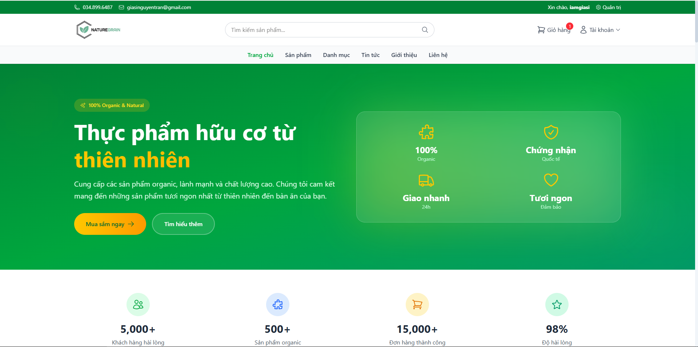
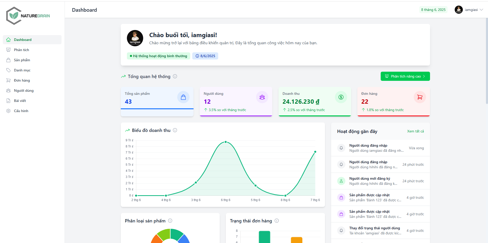

<div align="center">
  
  <h1>NatureGrain - Cửa hàng Thực phẩm Hữu cơ</h1>
  <p><strong>Dự án: Xây dựng Hệ thống Thương mại Điện tử Thực phẩm Hữu cơ</strong></p>
  <p><em>Phát triển bởi: Nguyễn Trần Gia Sĩ | Cập nhật: 08/06/2025</em></p>
</div>

<p align="center">
  <a href="https://reactjs.org/"></a>
  <a href="https://spring.io/projects/spring-boot"></a>
  <a href="https://mariadb.org/"></a>
  <a href="https://www.docker.com/"></a>
  <a href="https://vitejs.dev/"></a>
  <a href="https://cloudinary.com/"></a>
</p>

## 📸 Application Preview

<div align="center">
  <h3>🏠 Homepage - Customer Experience</h3>
  
  
  <h3>📊 Admin Dashboard - Management Interface</h3>
  
</div>

## 📝 Project Overview

**NatureGrain** is a comprehensive full-stack e-commerce platform specifically designed for organic food retail. This modern web application provides a seamless shopping experience for customers seeking premium organic products while offering powerful administrative tools for business management.

The platform combines cutting-edge web technologies with industry best practices to deliver a scalable, secure, and user-friendly solution that bridges the gap between organic food producers and conscious consumers.

### 🎯 Project Goals

- **Customer Focus**: Create an intuitive, fast, and reliable shopping experience
- **Business Efficiency**: Provide comprehensive tools for inventory, order, and customer management  
- **Scalability**: Build a robust architecture that can grow with business needs
- **Security**: Implement enterprise-grade security measures for data protection
- **Performance**: Ensure optimal loading times and responsive design across all devices
- **Sustainability**: Promote organic farming and sustainable food consumption

<details open>
<summary><h3>🌟 Key Features & Capabilities</h3></summary>

#### 🛒 Customer Experience
- **Modern Product Catalog**: Responsive product grid with advanced filtering and search
- **Smart Shopping Cart**: Real-time cart updates, quantity management, and price calculations
- **Secure Checkout**: Multi-step checkout process with guest and registered user options
- **User Accounts**: Profile management, order history, wishlist, and address book
- **Product Discovery**: Categories, featured products, recommendations, and related items
- **Content Management**: Rich blog content with recipes, nutrition tips, and organic farming insights
- **Responsive Design**: Optimized for desktop, tablet, and mobile devices

#### 📊 Admin Dashboard
- **Real-time Analytics**: Sales metrics, customer insights, and performance dashboards
- **Product Management**: CRUD operations, inventory tracking, category management
- **Order Processing**: Order status updates, fulfillment tracking, and customer communications
- **Customer Management**: User profiles, purchase history, and support ticket handling
- **Content Administration**: Blog post management, homepage content, and promotional banners
- **Image Management**: Cloudinary integration for optimized image upload and delivery

#### 🔧 Technical Excellence
- **Modern Architecture**: Microservices-inspired design with clear separation of concerns
- **API-First Approach**: RESTful APIs with comprehensive documentation and testing
- **Cloud Integration**: Cloudinary for image management and CDN delivery
- **Security Implementation**: JWT authentication, role-based access control, input validation
- **Performance Optimization**: Code splitting, lazy loading, caching strategies
- **DevOps Ready**: Docker containerization, environment configuration, and deployment automation
</details>

<details open>
<summary><h3>🚀 Technical Highlights</h3></summary>

#### Frontend Architecture
- **React 19** with modern hooks and functional components
- **Vite** for lightning-fast development and optimized production builds
- **TailwindCSS** for utility-first styling and responsive design
- **Context API** for state management across components
- **React Router v7** for client-side routing and navigation
- **Axios** with interceptors for API communication and error handling

#### Backend Architecture  
- **Spring Boot 2.7** with auto-configuration and embedded server
- **Spring Security** with JWT authentication and role-based authorization
- **Spring Data JPA** with Hibernate for database abstraction
- **MariaDB** as the primary relational database
- **Cloudinary SDK** for image upload, storage, and transformation
- **Swagger/OpenAPI** for comprehensive API documentation

#### DevOps & Deployment
- **Docker** containerization for consistent deployment environments
- **Docker Compose** for multi-container orchestration
- **Environment Configuration** with separate configs for dev/staging/production
- **Health Checks** and monitoring for application reliability
- **Volume Mounts** for persistent data storage
</details>

## 🚀 Technology Stack & Architecture

<details open>
<summary><h3>💻 Frontend Technologies</h3></summary>

| Technology | Version | Purpose | Benefits |
|------------|---------|---------|----------|
| **React** | 19.x | UI Framework | Modern hooks, concurrent features, component reusability |
| **Vite** | 5.x | Build Tool | Lightning-fast HMR, optimized bundling, ES modules |
| **React Router** | v7 | Client Routing | Data APIs, loaders, nested routes, code splitting |
| **TailwindCSS** | 3.x | CSS Framework | Utility-first, JIT compilation, responsive design |
| **Axios** | Latest | HTTP Client | Request/response interceptors, error handling, cancellation |
| **Heroicons** | 2.x | Icon Library | Consistent iconography, SVG-based, lightweight |
| **React Context** | Built-in | State Management | Global state without external dependencies |
| **JWT Decode** | Latest | Authentication | Token parsing and validation on client-side |

#### Frontend Architecture Patterns
- **Component-Driven Development**: Reusable, testable UI components
- **Custom Hooks**: Business logic separation and reusability  
- **Context + Reducer**: Scalable state management for complex states
- **Error Boundaries**: Graceful error handling and fallback UI
- **Lazy Loading**: Code splitting for optimal bundle size
- **Progressive Enhancement**: Works with and without JavaScript
</details>

<details open>
<summary><h3>🛠️ Backend Technologies</h3></summary>

| Technology | Version | Purpose | Benefits |
|------------|---------|---------|----------|
| **Spring Boot** | 2.7.x | Framework | Auto-configuration, embedded server, production-ready |
| **Spring Security** | 5.7.x | Security | JWT auth, CORS, CSRF protection, method security |
| **Spring Data JPA** | 2.7.x | Data Access | Repository pattern, query generation, transaction management |
| **Hibernate** | 5.6.x | ORM | Object-relational mapping, caching, lazy loading |
| **MariaDB** | 10.6+ | Database | ACID compliance, performance, MySQL compatibility |
| **Cloudinary** | Java SDK | Media Management | Image optimization, transformation, CDN delivery |
| **JWT (JJWT)** | 0.11.x | Authentication | Stateless auth, secure token generation |
| **Lombok** | 1.18.x | Code Generation | Reduced boilerplate, cleaner code |
| **Swagger** | 3.x | API Documentation | Interactive API docs, testing interface |
| **Dotenv** | 2.3.x | Configuration | Environment variable management |

#### Backend Architecture Patterns
- **RESTful API Design**: Resource-based URLs, HTTP methods, status codes
- **Layered Architecture**: Controller → Service → Repository → Entity
- **Dependency Injection**: Loose coupling, testability, configuration management
- **Exception Handling**: Global exception handlers, custom error responses
- **Validation**: Bean validation with custom validators
- **Security**: JWT-based stateless authentication with role-based access
</details>

<details open>
<summary><h3>🔄 DevOps & Infrastructure</h3></summary>

| Technology | Purpose | Configuration |
|------------|---------|---------------|
| **Docker** | Containerization | Multi-stage builds, optimized images |
| **Docker Compose** | Orchestration | Multi-container development environment |
| **Nginx** | Reverse Proxy | Load balancing, static file serving |
| **MariaDB** | Database | Persistent volumes, initialization scripts |
| **Cloudinary** | CDN/Storage | Image optimization, global delivery |

#### Infrastructure Features
- **Container Health Checks**: Automatic restart on failure
- **Volume Persistence**: Data survival across container restarts  
- **Environment Separation**: Dev/staging/production configurations
- **Resource Optimization**: Memory and CPU limits for containers
- **Network Isolation**: Secure inter-container communication
</details>

<details>
<summary><h3>📊 Development Tools & Quality Assurance</h3></summary>

#### Development Environment
- **Node.js 18+**: JavaScript runtime for frontend development
- **JDK 17+**: Java development kit for backend services
- **Maven 3.8+**: Dependency management and build automation
- **Git**: Version control with conventional commit messages
- **VS Code**: Recommended IDE with extensions for React and Java

#### Code Quality & Testing
- **ESLint**: JavaScript/React code linting and formatting
- **Prettier**: Code formatting and style consistency  
- **Husky**: Git hooks for pre-commit quality checks
- **JUnit 5**: Unit testing framework for Java backend
- **Jest**: JavaScript testing framework for frontend
- **Postman**: API testing and documentation

#### Performance Monitoring
- **React DevTools**: Component debugging and performance profiling
- **Chrome DevTools**: Network analysis, performance auditing
- **Spring Boot Actuator**: Application metrics and health endpoints
- **Database Profiling**: Query optimization and performance tuning
</details>

## 🛠️ Installation & Setup Guide

<details open>
<summary><h3>🐳 Method 1: Docker Deployment (Recommended)</h3></summary>

The fastest way to run the complete NatureGrain system is using Docker Compose. This method automatically sets up all services with proper networking and volume configuration.

#### Prerequisites
- **Docker**: Version 20.0+ with Docker Compose
- **Git**: For cloning the repository
- **8GB RAM**: Recommended for optimal performance

#### Quick Start
```bash
# Clone the repository
git clone https://github.com/giasinguyen/NatureGrain.git
cd NatureGrain

# Copy environment template (optional customization)
cp .env.example .env

# Start all services in detached mode
docker-compose up -d

# View container logs (optional)
docker-compose logs -f
```

#### Service Access Points
After successful startup, access the application at:

| Service | URL | Description |
|---------|-----|-------------|
| **Frontend** | [http://localhost](http://localhost) | Customer-facing website |
| **Backend API** | [http://localhost:8080/api](http://localhost:8080/api) | REST API endpoints |
| **API Documentation** | [http://localhost:8080/api/swagger-ui.html](http://localhost:8080/api/swagger-ui.html) | Interactive API docs |
| **Database** | `localhost:3306` | MariaDB (internal access) |

#### Docker Management Commands
```bash
# Stop all services
docker-compose down

# Stop and remove all data (complete reset)
docker-compose down -v

# View service status
docker-compose ps

# Access logs for specific service
docker-compose logs [frontend|backend|database]

# Rebuild services after code changes
docker-compose up --build
```

#### Production Deployment
For production environments, see detailed deployment guide in [DEPLOYMENT.md](DEPLOYMENT.md).
</details>

<details>
<summary><h3>💻 Method 2: Manual Development Setup</h3></summary>

For development and customization, you can run the services manually with full control over the environment.

#### System Requirements
| Component | Minimum Version | Recommended |
|-----------|----------------|-------------|
| **Node.js** | 18.0+ | Latest LTS (20.x) |
| **Java JDK** | 17+ | JDK 17 or 21 |
| **MariaDB** | 10.6+ | Latest stable |
| **Maven** | 3.8+ | Latest version |
| **RAM** | 4GB | 8GB+ |
| **Storage** | 5GB | 10GB+ |

#### Environment Configuration

Create the required environment files:

**Backend (.env in `BackEnd/` directory):**
```env
# Database Configuration
DATABASE_URL=jdbc:mysql://localhost:3306/naturegrain?useSSL=false&allowPublicKeyRetrieval=true
DATABASE_USERNAME=root
DATABASE_PASSWORD=your_secure_password

# Cloudinary Configuration (sign up at cloudinary.com)
CLOUDINARY_CLOUD_NAME=your_cloud_name
CLOUDINARY_API_KEY=your_api_key
CLOUDINARY_API_SECRET=your_api_secret
CLOUDINARY_FOLDER=naturegrain_products

# Security Configuration
JWT_SECRET=your_super_secure_jwt_secret_key_minimum_256_bits
JWT_EXPIRATION=86400000

# Application Configuration
SPRING_PROFILES_ACTIVE=dev
SERVER_PORT=8080
```

**Frontend (.env.development in `FrontEnd/` directory):**
```env
# API Configuration
VITE_API_URL=http://localhost:8080/api
VITE_APP_NAME=NatureGrain
VITE_APP_VERSION=1.0.0

# Cloudinary Configuration
VITE_CLOUDINARY_CLOUD_NAME=your_cloud_name

# Development Configuration
VITE_DEBUG_MODE=true
VITE_IMAGE_FALLBACK_URL=/dummy.png
```

#### Database Setup

1. **Install and start MariaDB:**
```bash
# Ubuntu/Debian
sudo apt update && sudo apt install mariadb-server
sudo systemctl start mariadb

# macOS (using Homebrew)
brew install mariadb
brew services start mariadb

# Windows (download from mariadb.org)
```

2. **Create database and user:**
```sql
-- Connect to MariaDB
mysql -u root -p

-- Create database
CREATE DATABASE naturegrain 
CHARACTER SET utf8mb4 
COLLATE utf8mb4_unicode_ci;

-- Create dedicated user (optional but recommended)
CREATE USER 'naturegrain'@'localhost' IDENTIFIED BY 'secure_password';
GRANT ALL PRIVILEGES ON naturegrain.* TO 'naturegrain'@'localhost';
FLUSH PRIVILEGES;
```

3. **Import initial data:**
```bash
# Import database schema and sample data
mysql -u root -p naturegrain < naturegrain.sql
```

#### Backend Setup

1. **Navigate to backend directory:**
```bash
cd BackEnd
```

2. **Install dependencies and run:**
```bash
# Linux/macOS
./mvnw clean install
./mvnw spring-boot:run

# Windows
mvnw.cmd clean install
mvnw.cmd spring-boot:run
```

3. **Verify backend is running:**
```bash
# Check health endpoint
curl http://localhost:8080/api/health

# Expected response: {"status":"UP"}
```

#### Frontend Setup

1. **Navigate to frontend directory:**
```bash
cd FrontEnd
```

2. **Install dependencies:**
```bash
# Install with npm
npm install

# Or with yarn (if preferred)
yarn install
```

3. **Start development server:**
```bash
# Development mode with hot reload
npm run dev

# Or with yarn
yarn dev
```

4. **Verify frontend is running:**
Open [http://localhost:5173](http://localhost:5173) in your browser.

#### Production Build

**Frontend production build:**
```bash
cd FrontEnd
npm run build

# Serve the built files (optional)
npm run preview
```

**Backend production JAR:**
```bash
cd BackEnd
./mvnw clean package -DskipTests
java -jar target/naturegrain-0.0.1-SNAPSHOT.jar
```
</details>

<details>
<summary><h3>🧪 Testing & Quality Assurance</h3></summary>

#### Backend Testing
```bash
cd BackEnd

# Run all tests
./mvnw test

# Run tests with coverage
./mvnw test jacoco:report

# Run specific test class
./mvnw test -Dtest=ProductServiceTest

# Integration tests
./mvnw verify
```

#### Frontend Testing
```bash
cd FrontEnd

# Unit tests
npm run test

# End-to-end tests
npm run test:e2e

# Run tests in watch mode
npm run test:watch

# Generate coverage report
npm run test:coverage
```

#### Code Quality Checks
```bash
# Frontend linting
npm run lint
npm run lint:fix

# Backend code formatting
./mvnw spotless:check
./mvnw spotless:apply
```
</details>

<details>
<summary><h3>⚙️ Environment Configuration</h3></summary>

NatureGrain supports multiple deployment environments with specific configurations:

#### Available Environments

| Environment | Purpose | Configuration File |
|-------------|---------|-------------------|
| **Development** | Local development | `.env.development` |
| **Testing** | Automated testing | `.env.test` |
| **Staging** | Pre-production testing | `.env.staging` |
| **Production** | Live deployment | `.env.production` |

#### Switching Environments

**Backend environment switching:**
```bash
# Set Spring profile
export SPRING_PROFILES_ACTIVE=prod

# Run with specific profile
./mvnw spring-boot:run -Dspring.profiles.active=prod
```

**Frontend environment switching:**
```bash
# Development (default)
npm run dev

# Production build
npm run build

# Staging
npm run build:staging
```

#### Configuration Validation

Ensure your configuration is correct by running the validation scripts:

```bash
# Validate backend configuration
./mvnw validate

# Check frontend environment variables
npm run check:env
```
</details>

## ✨ Feature Showcase

<details open>
<summary><h3>🛍️ Customer Features</h3></summary>

#### Product Discovery & Shopping
- **Smart Product Catalog**: Advanced filtering by category, price, rating, and organic certifications
- **Intelligent Search**: Auto-complete, typo tolerance, and semantic search capabilities
- **Product Recommendations**: AI-driven suggestions based on browsing history and preferences
- **Wishlist Management**: Save favorite products and share with others
- **Product Comparison**: Side-by-side comparison of product features and prices
- **Stock Availability**: Real-time inventory tracking with low-stock notifications

#### Shopping Experience
- **Dynamic Shopping Cart**: Real-time updates, quantity adjustments, and price calculations
- **Guest Checkout**: Streamlined purchase process without mandatory registration
- **Multiple Payment Methods**: Credit cards, PayPal, bank transfers, and digital wallets
- **Delivery Options**: Standard, express, and scheduled delivery with tracking
- **Order Management**: View order history, track shipments, and manage returns
- **Mobile Optimization**: Responsive design optimized for all device sizes

#### Content & Community
- **Nutrition Blog**: Expert articles on organic farming, healthy recipes, and lifestyle tips
- **Product Reviews**: Verified customer reviews with photos and ratings
- **Q&A System**: Community-driven questions and answers about products
- **Newsletter Subscription**: Regular updates on new products and health tips
- **Social Sharing**: Share favorite products and recipes on social media
</details>

<details open>
<summary><h3>📊 Admin & Management Features</h3></summary>

#### Dashboard & Analytics
- **Real-time Metrics**: Sales performance, customer activity, and inventory levels
- **Revenue Analytics**: Daily, weekly, monthly, and yearly sales reports
- **Customer Insights**: Demographics, purchase patterns, and loyalty metrics
- **Traffic Analysis**: Website visitors, page views, and conversion rates
- **Performance Monitoring**: Page load times, API response times, and error rates

#### Product Management
- **Bulk Operations**: Import/export products via CSV, bulk price updates
- **Category Management**: Hierarchical category structure with custom attributes
- **Inventory Tracking**: Stock levels, reorder points, and automated alerts
- **Price Management**: Dynamic pricing, bulk discounts, and promotional campaigns
- **Image Optimization**: Automatic image compression, resizing, and format conversion
- **SEO Tools**: Meta tags, URL optimization, and search engine visibility

#### Order & Customer Management
- **Order Processing**: Status updates, fulfillment tracking, and automated notifications
- **Customer Support**: Ticket management, live chat integration, and response tracking
- **User Management**: Role-based permissions, account verification, and access control
- **Communication Tools**: Email campaigns, SMS notifications, and push messages
- **Return Management**: RMA processing, refund handling, and inventory adjustments

#### Content Management
- **Blog Editor**: Rich text editor with media embedding and SEO optimization
- **Banner Management**: Homepage banners, promotional displays, and A/B testing
- **Template System**: Customizable email templates and notification layouts
- **Multi-language Support**: Content localization and language-specific pricing
</details>

<details>
<summary><h3>🔧 Technical Features</h3></summary>

#### Performance & Scalability
- **Lazy Loading**: Progressive content loading for faster page loads
- **CDN Integration**: Cloudinary CDN for global image delivery
- **Caching Strategy**: Multi-level caching for API responses and static content
- **Database Optimization**: Query optimization and connection pooling
- **Code Splitting**: Dynamic imports for reduced initial bundle size

#### Security & Compliance
- **JWT Authentication**: Stateless, secure token-based authentication
- **Role-Based Access**: Granular permissions for different user types
- **Input Validation**: Server-side validation for all user inputs
- **SQL Injection Protection**: Parameterized queries and ORM safety
- **XSS Prevention**: Content sanitization and output encoding
- **HTTPS Enforcement**: SSL/TLS encryption for all communications

#### Integration & Extensibility
- **RESTful API**: Well-documented API for third-party integrations
- **Webhook Support**: Real-time notifications for external systems
- **Payment Gateway**: Extensible payment system for multiple providers
- **Shipping Integration**: API connections to major shipping carriers
- **Analytics Integration**: Google Analytics, Facebook Pixel, and custom tracking
</details>

<details open>
<summary><h3>🖥️ Frontend Structure</h3></summary>

```
FrontEnd/
├── public/                # Tài nguyên tĩnh
│   ├── Naturegrain.png    # Logo chính
│   ├── dummy.png          # Hình ảnh placeholder
│   └── vite.svg           # Logo Vite
├── src/
│   ├── assets/            # Tài nguyên dùng trong ứng dụng
│   │   ├── images/        # Hình ảnh và icons
│   │   └── styles/        # CSS và style modules
│   ├── components/        # Components tái sử dụng
│   │   ├── admin/         # Components cho trang quản trị
│   │   │   ├── dashboard/ # Dashboard widgets
│   │   │   ├── product/   # Product management
│   │   │   └── user/      # User management
│   │   ├── layout/        # Layout components
│   │   │   ├── Header.jsx # Header component
│   │   │   ├── Footer.jsx # Footer component
│   │   │   └── Sidebar.jsx# Sidebar for admin
│   │   └── ui/            # UI components
│   │       ├── buttons/   # Button components
│   │       ├── cards/     # Card components
│   │       ├── forms/     # Form elements
│   │       ├── loaders/   # Loading indicators
│   │       └── modals/    # Modal dialogs
│   ├── context/           # React Context API
│   │   ├── AuthContext.jsx# Authentication context
│   │   └── CartContext.jsx# Shopping cart context
│   ├── hooks/             # Custom React hooks
│   │   ├── useCachedFetch.js # API caching hook
│   │   ├── useError.js    # Error handling
│   │   ├── useForm.js     # Form handling
│   │   └── useLocalStorage.js # Local storage
│   ├── pages/             # Page components
│   │   ├── admin/         # Admin pages
│   │   ├── auth/          # Auth pages
│   │   ├── user/          # User pages
│   │   ├── HomePage.jsx   # Homepage
│   │   ├── ProductsPage.jsx # Products listing
│   │   └── ProductDetailPage.jsx # Product detail
│   ├── services/          # API services
│   │   ├── api.js         # Base API config
│   │   ├── authService.js # Auth services
│   │   └── productService.js # Product services
│   ├── utils/             # Utility functions
│   │   ├── imageUtils.js  # Image processing
│   │   ├── imageTests.js  # Image testing
│   │   ├── formatters.js  # Data formatting
│   │   └── validators.js  # Data validation
│   ├── App.jsx            # Main App component
│   └── main.jsx           # Entry point
├── .env                   # Base environment vars
├── .env.development       # Dev environment vars
├── .env.production        # Production environment vars
├── index.html             # HTML template
├── package.json           # Dependencies and scripts
└── vite.config.js         # Vite configuration
```
</details>

<details open>
<summary><h3>⚙️ Backend Structure</h3></summary>

```
BackEnd/
├── src/
│   ├── main/
│   │   ├── java/
│   │   │   └── com/
│   │   │       └── naturegrain/
│   │   │           ├── config/           # Cấu hình
│   │   │           │   ├── CloudinaryConfig.java
│   │   │           │   ├── DotenvConfig.java
│   │   │           │   ├── WebSecurityConfig.java
│   │   │           │   └── SwaggerConfig.java
│   │   │           ├── controller/       # REST Controllers
│   │   │           │   ├── admin/        # Admin controllers
│   │   │           │   ├── AuthController.java
│   │   │           │   ├── ProductController.java
│   │   │           │   └── OrderController.java
│   │   │           ├── entity/           # Database entities
│   │   │           │   ├── Product.java
│   │   │           │   ├── User.java
│   │   │           │   ├── Order.java
│   │   │           │   └── Category.java
│   │   │           ├── exception/        # Exception handling
│   │   │           │   ├── GlobalExceptionHandler.java
│   │   │           │   ├── ResourceNotFoundException.java
│   │   │           │   └── ApiException.java
│   │   │           ├── model/            # DTOs and models
│   │   │           │   ├── request/      # Request objects
│   │   │           │   ├── response/     # Response objects
│   │   │           │   └── dto/          # Data Transfer Objects
│   │   │           ├── repository/       # JPA Repositories
│   │   │           │   ├── ProductRepository.java
│   │   │           │   ├── UserRepository.java
│   │   │           │   └── OrderRepository.java
│   │   │           ├── security/         # Security components
│   │   │           │   ├── jwt/          # JWT implementation
│   │   │           │   ├── services/     # Security services
│   │   │           │   └── WebSecurityConfig.java
│   │   │           └── service/          # Business logic
│   │   │               ├── ProductService.java
│   │   │               ├── UserService.java
│   │   │               ├── OrderService.java
│   │   │               └── CloudinaryService.java
│   │   └── resources/
│   │       ├── application.properties    # Cấu hình chung
│   │       ├── config/                   # Cấu hình theo môi trường
│   │       │   ├── application-dev.properties
│   │       │   ├── application-prod.properties
│   │       │   └── application-test.properties
│   │       └── static/                   # Static resources
│   └── test/                             # Unit & integration tests
│       └── java/
│           └── com/
│               └── naturegrain/
│                   ├── controller/
│                   ├── service/
│                   └── repository/
├── .env                                 # Environment variables
├── mvnw                                 # Maven wrapper (Unix)
├── mvnw.cmd                             # Maven wrapper (Windows)
├── pom.xml                              # Maven dependencies
├── naturegrain.sql                      # Database schema
└── Dockerfile                           # Docker configuration
```
</details>

<details>
<summary><h3>🔄 DevOps Structure</h3></summary>

```
NatureGrain/
├── docker-compose.yml                  # Docker Compose configuration 
├── DEPLOYMENT.md                       # Hướng dẫn triển khai
├── .dockerignore                       # Files to ignore in Docker context
├── FrontEnd/
│   └── Dockerfile                      # Frontend Docker configuration
└── BackEnd/
    └── Dockerfile                      # Backend Docker configuration
```
</details>

## 🛡️ Bảo mật & Hiệu suất

<details open>
<summary><h3>🔒 Tính năng bảo mật</h3></summary>

| Tính năng | Mô tả | Thực thi |
|-----------|-------|----------|
| **JWT Authentication** | Xác thực người dùng bằng JSON Web Tokens | Spring Security + Frontend Auth Context |
| **CORS Protection** | Bảo vệ khỏi Cross-Origin Resource Sharing attacks | Spring Security Config + Headers |
| **Password Encryption** | Mã hóa mật khẩu một chiều với salt | BCrypt + Password Encoder |
| **Role-Based Access Control** | Phân quyền người dùng theo vai trò | Custom Authorities + Method Security |
| **Input Validation** | Kiểm tra và làm sạch đầu vào | Bean Validation + Content Filtering |
| **XSS Protection** | Ngăn chặn Cross-Site Scripting | Content Security Policy + Output Encoding |
| **CSRF Protection** | Ngăn chặn Cross-Site Request Forgery | CSRF Tokens + SameSite Cookies |
| **Rate Limiting** | Giới hạn số lượng request | IP-based + User-based Throttling |
| **Secure Cookies** | Bảo vệ thông tin phiên | HttpOnly + Secure Flags |
| **Environment Variables** | Bảo mật thông tin nhạy cảm | Dotenv + Config Server |
| **Cloudinary Security** | Bảo vệ tài sản media | Signed URLs + Asset Transformations |
</details>

<details open>
<summary><h3>⚡ Tối ưu hiệu suất</h3></summary>

#### Frontend Optimizations
- **API Response Caching**: Lưu trữ tạm thời kết quả API để giảm số lượng request
- **Code Splitting**: Chia nhỏ JavaScript bundle để tải theo nhu cầu
- **Component Lazy Loading**: Chỉ tải các component khi cần thiết
- **Image Optimization**: 
  - Progressive Loading (blur-up technique)
  - Responsive sizes với srcset
  - WebP format với fallback
  - Cloudinary transformations
- **Retry Mechanism**: Tự động thử lại các API calls thất bại
- **Debounce & Throttle**: Tối ưu các event handlers
- **React.memo & useMemo**: Tránh render lại không cần thiết
- **Error Boundaries**: Ngăn chặn crash toàn ứng dụng do lỗi component
- **Web Vitals Monitoring**: Theo dõi Core Web Vitals

#### Backend Optimizations
- **Database Indexing**: Indexes tối ưu cho truy vấn phổ biến
- **Query Optimization**: Tối ưu JPQL/HQL cho các truy vấn phức tạp
- **Connection Pooling**: HikariCP để quản lý kết nối database
- **Caching Layer**: 
  - Second-level cache với Hibernate
  - Method-level caching với Spring Cache
- **Pagination & Infinite Scrolling**: Tải dữ liệu theo trang cho danh sách lớn
- **Asynchronous Processing**: Xử lý bất đồng bộ cho các tác vụ nặng
- **Resource Compression**: GZIP/Brotli compression cho responses
- **Content Delivery Network**: Sử dụng Cloudinary CDN cho assets

#### DevOps Optimizations
- **Container Optimization**: Multi-stage builds để giảm image size
- **Resource Allocation**: Cấu hình tài nguyên phù hợp cho containers
- **Load Balancing**: Phân phối tải giữa nhiều instances
- **Health Checks**: Giám sát tình trạng ứng dụng
</details>

## 📚 Tài liệu & tài nguyên

<details>
<summary><h3>📜 Tài liệu API</h3></summary>

API Documentation được tạo tự động bằng Swagger/OpenAPI và có sẵn tại các địa chỉ sau khi chạy backend:

- **Swagger UI**: [http://localhost:8080/api/swagger-ui.html](http://localhost:8080/api/swagger-ui.html)
- **OpenAPI Spec**: [http://localhost:8080/api/v3/api-docs](http://localhost:8080/api/v3/api-docs)

Danh mục các API chính:
- **Auth**: `/api/auth/*` - Đăng ký, đăng nhập, refresh token
- **Products**: `/api/product/*` - CRUD sản phẩm, tìm kiếm, lọc
- **Categories**: `/api/category/*` - Quản lý danh mục
- **Orders**: `/api/order/*` - Đặt hàng, theo dõi đơn hàng
- **Users**: `/api/user/*` - Quản lý người dùng, phân quyền
- **File Upload**: `/api/cloudinary/*` - Tải lên và quản lý hình ảnh
- **Dashboard**: `/api/dashboard/*` - Số liệu thống kê, báo cáo
- **Analytics**: `/api/analytics/*` - Phân tích dữ liệu nâng cao

Chi tiết API có trong [Postman_API_Guide.md](Postman_API_Guide.md).
</details>

<details>
<summary><h3>📦 Hướng dẫn triển khai</h3></summary>

Xem chi tiết trong [DEPLOYMENT.md](DEPLOYMENT.md) để biết cách:

- Triển khai trên các môi trường khác nhau (Development, Staging, Production)
- Cấu hình CI/CD pipeline
- Monitoring và logging
- Backup và restore dữ liệu
- Scaling ứng dụng
</details>

<details>
<summary><h3>🧩 Kiến trúc hệ thống</h3></summary>

**NatureGrain** sử dụng kiến trúc microservices-inspired với frontend và backend tách biệt:

```
┌─────────────┐     ┌─────────────┐     ┌─────────────────┐
│   Browser   │────▶│   Frontend  │────▶│     Backend     │
│    User     │◀────│   (React)   │◀────│  (Spring Boot)  │
└─────────────┘     └─────────────┘     └────────┬────────┘
                                                 │
                                        ┌────────▼────────┐
                                        │    Database     │
                                        │    (MariaDB)    │
                                        └─────────────────┘
                                                 │
                                        ┌────────▼────────┐
                                        │   File Storage  │
                                        │   (Cloudinary)  │
                                        └─────────────────┘
```

**Security Flow**:
```
  User
   │
   ▼
┌─────────────┐   (1) Login Request   ┌─────────────┐
│   Frontend  │───────────────────────▶│   Backend   │
│             │◀───────────────────────│             │
└─────────────┘   (2) JWT Token       └─────────────┘
   │                                        │
   │  (3) Store Token                       │ (4) Verify Token
   ▼                                        ▼
┌─────────────┐   (5) API Request    ┌─────────────┐
│  Frontend   │───────────────────────▶│  Backend    │
│  with Token │◀───────────────────────│             │
└─────────────┘   (6) Protected Data   └─────────────┘
```
</details>

## 🔄 Lộ trình phát triển

| Phiên bản | Trạng thái | Tính năng chính |
|-----------|------------|-----------------|
| v1.0.0    | ✅ Hoàn thành | Core e-commerce, hệ thống sản phẩm, giỏ hàng, đơn hàng |
| v1.1.0    | ✅ Hoàn thành | Blog, quản lý hình ảnh Cloudinary, dashboard quản trị |
| v1.2.0    | ✅ Hoàn thành | Phân tích dữ liệu nâng cao, tối ưu hiệu suất |
| v1.3.0    | 🔄 Đang phát triển | Tích hợp thanh toán trực tuyến, thông báo real-time |
| v1.4.0    | 📅 Dự kiến Q3/2025 | App mobile, Progressive Web App (PWA) |
| v2.0.0    | 📅 Dự kiến Q4/2025 | Recommendation engine, personalization |

## 👥 Tác giả

- **Nguyễn Trần Gia Sĩ** - [GitHub Profile](https://github.com/giasinguyen)

## 📞 Liên hệ & Hỗ trợ

Nếu bạn có câu hỏi hoặc cần hỗ trợ:
- **Email**: giasinguyentran@gmail.com.com
- **Website**: [naturegrain.example.com](https://naturegrain.com)
- **Báo cáo lỗi**: [GitHub Issues](https://github.com/giasinguyen/NatureGrain/issues)

## 🙏 Ghi nhận

- Dự án này lấy cảm hứng từ các cửa hàng thực phẩm hữu cơ hàng đầu
- Sử dụng nhiều thư viện và công cụ mã nguồn mở:
  - [React](https://reactjs.org/)
  - [Spring Boot](https://spring.io/projects/spring-boot)
  - [Vite](https://vitejs.dev/)
  - [MariaDB](https://mariadb.org/)
  - [Docker](https://www.docker.com/)
  - [Cloudinary](https://cloudinary.com/)
- Cảm ơn cộng đồng phát triển vì tất cả các tài nguyên và hướng dẫn hữu ích
